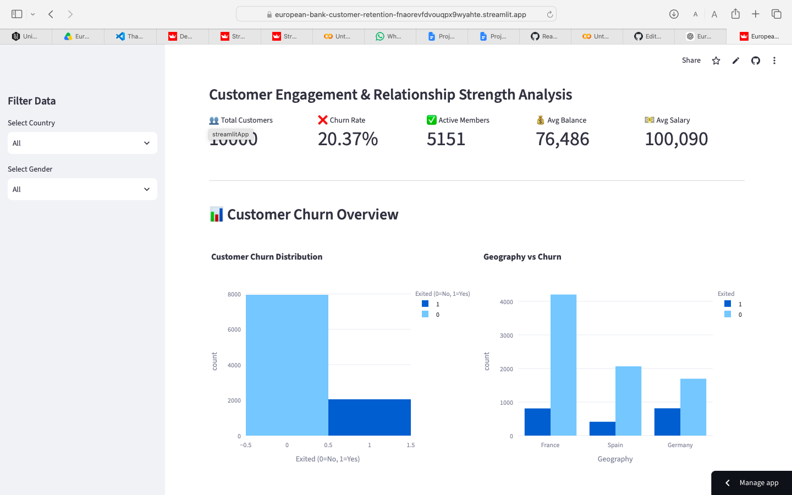

# 🏦 European Bank Customer Retention Dashboard
An interactive Streamlit dashboard to analyze customer engagement, product utilization, and churn behavior using the European Bank dataset.


## 📌 Project Overview

The **European Bank Customer Retention Dashboard** is an interactive data analytics project developed using **Python**, **Streamlit**, and **Plotly**. It analyzes customer behavior, engagement, product usage, and financial information to identify customers who are likely to churn and provides insights to improve customer retention.

---

## 📸 Dashboard Preview



---

## 🎯 Project Objectives

- Analyze customer churn patterns.
- Evaluate customer engagement and activity.
- Measure the impact of product usage on retention.
- Identify high-value inactive customers.
- Support engagement-driven retention strategies.

---

## 📂 Dataset Information

**Dataset Name:** European_Bank.csv

**Target Variable:** Exited (Customer Churn)

### Features

- CustomerId
- Surname
- CreditScore
- Geography
- Gender
- Age
- Tenure
- Balance
- NumOfProducts
- HasCrCard
- IsActiveMember
- EstimatedSalary
- Exited

---

## 🛠 Technologies Used

- Python
- Pandas
- NumPy
- Plotly
- Streamlit
- GitHub

---

## 📊 Dashboard Features

- 📈 KPI Cards
- 🌍 Geography-wise Churn Analysis
- 👨 Gender-wise Churn Analysis
- 📦 Product Utilization Analysis
- 👥 Active vs Inactive Customer Analysis
- 💰 Balance Analysis
- ⭐ High-Value Customer Detector
- 📥 Download Processed Dataset

---

## 📈 Key Insights

- Active customers have significantly lower churn.
- Customers using multiple bank products show higher retention.
- High-balance inactive customers are more likely to churn.
- Customer engagement plays a major role in long-term loyalty.

---

## 📁 Project Structure

```
European-Bank-Customer-Retention/
│── app.py
│── Processed_Bank_Data.csv
│── requirements.txt
│── README.md
│── dashboard.png
```

---

## 🚀 Live Dashboard

**Streamlit Deployment:**  
(https://european-bank-customer-retention-fnaorevfdvouqpx9wyahte.streamlit.app)

---

## 📂 GitHub Repository

(https://github.com/sarasingh2311-netizen/European-Bank-Customer-Retention/tree/main)

---

## 👩‍💻 Author

**Sara Singh**  
**B.Com (Hons.) Student**  
**Unified Mentor Internship Project**
